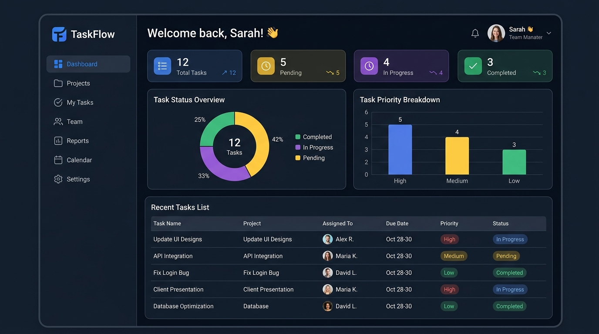
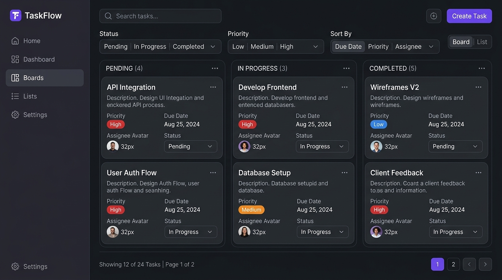
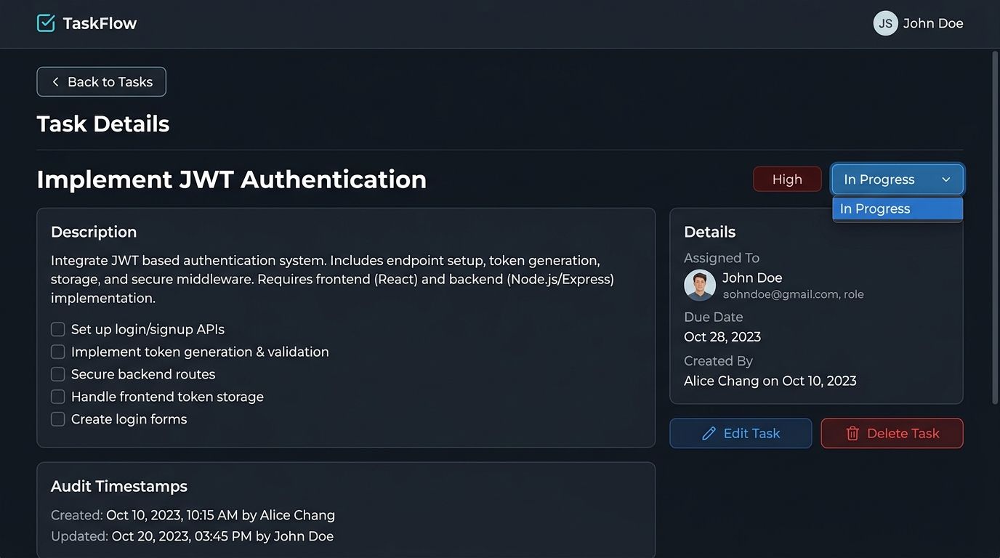
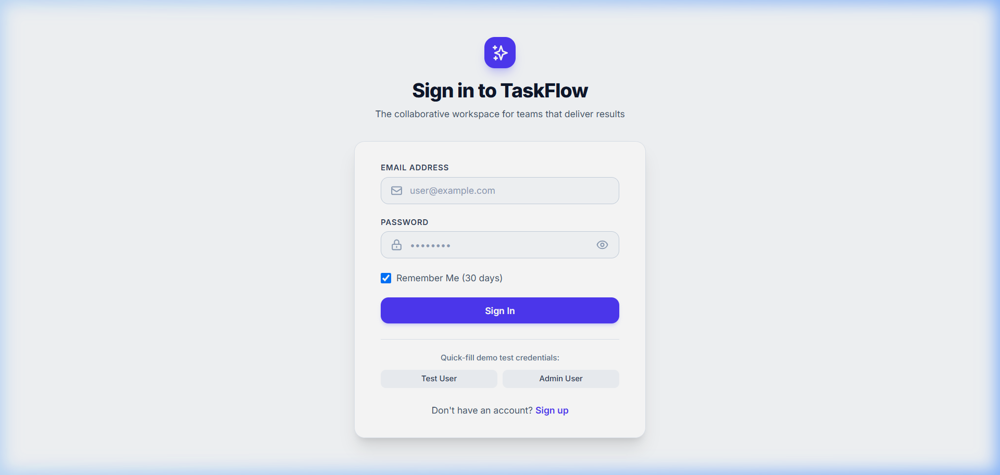

# TaskFlow — Task & Team Management Platform

A modern, production-grade, full-stack Task and Team Management web application built with the MERN stack (MongoDB, Express, React, Node.js), Vite, Redux Toolkit, and Tailwind CSS.

---

## 🚀 Live Demo & Links

- **Frontend Live URL**: `https://taskflow-client.vercel.app` *(Placeholder - configure after Vercel deployment)*
- **Backend API Live URL**: `https://taskflow-api.onrender.com` *(Placeholder - configure after Render deployment)*

---

## 📌 Project Overview

TaskFlow is designed to help high-velocity engineering and product teams organize, prioritize, track, and complete tasks with complete visibility. Featuring a clean, responsive interface, JWT authentication with customizable session persistence, real-time metrics, interactive Recharts data visualizations, server-side pagination, and dark mode.

---

## 🌟 Key Features & Implemented Bonus Features

### Core Capabilities
- **Authentication & Authorization**: Secure signup, login, session management with bcryptjs password hashing and JWT.
- **Remember Me**: 
  - Checked: Persists in `localStorage` with a 30-day token expiry.
  - Unchecked: Stores in `sessionStorage` with a 1-day token expiry.
- **Task Management (CRUD)**:
  - Create, view, edit, and delete tasks.
  - Interactive status dropdowns directly on task cards.
  - Detailed task view with assignment information and audit timestamps.
  - Delete confirmation dialog.
- **Filtering, Search & Sorting**:
  - Debounced case-insensitive title search (using custom `useDebounce` hook).
  - Status filter (`All`, `Pending`, `In Progress`, `Completed`).
  - Priority filter (`All`, `Low`, `Medium`, `High`).
  - Sort by Due Date or Creation Date with Ascending/Descending toggles.
- **User Assignment**: Real-time user assignment fetched from `GET /users`.

### 🎁 All 4 Bonus Features Implemented
1. **Dark Mode**:
   - Integrated with Tailwind CSS `dark` class.
   - Theme toggle in the header navbar.
   - Preference persisted across sessions via `localStorage`.
2. **Toast Notifications**:
   - Integrated with `react-hot-toast` for real-time success and error alerts across authentication and task operations.
3. **Server-Side Pagination**:
   - Fully connected to backend `page` and `limit` query parameters with total pages, item counters, and Previous/Next controls.
4. **Interactive Dashboard Charts**:
   - Built using **Recharts**:
     - **Doughnut/Pie Chart** for task status distribution (`Pending`, `In Progress`, `Completed`).
     - **Bar Chart** for task priority breakdown (`Low`, `Medium`, `High`).

---

## 🛠️ Tech Stack

### Frontend
- **Library/Runtime**: React 19, Vite
- **Routing**: React Router DOM v7 (with `React.lazy` and `Suspense`)
- **State Management**: Redux Toolkit (`authSlice`, `tasksSlice`, `createAsyncThunk`)
- **Styling**: Tailwind CSS v4, Vanilla CSS design tokens
- **HTTP Client**: Axios with request (JWT attachment) and response (401 interceptor & network error handling) interceptors
- **Icons**: React Icons (Heroicons)
- **Charts**: Recharts
- **Notifications**: react-hot-toast

### Backend
- **Runtime**: Node.js, Express.js
- **Database**: MongoDB Atlas / Mongoose ODM
- **Security & Headers**: Helmet, CORS, express-rate-limit
- **Authentication**: JSON Web Token (JWT), bcryptjs
- **Logging**: Morgan

### Deployment Targets
- **Frontend**: Vercel (`vercel.json` SPA rewrites configured)
- **Backend**: Render (`render.yaml` infrastructure-as-code configured)
- **Database**: MongoDB Atlas

---

## 🏛️ Architecture & Folder Structure

```
taskflow/
├── client/
│   ├── public/
│   ├── src/
│   │   ├── api/
│   │   │   └── axios.js          # Axios client instance
│   │   ├── components/
│   │   │   ├── Layout/
│   │   │   │   ├── Layout.jsx     # App shell with responsive drawer
│   │   │   │   ├── Navbar.jsx     # Theme switcher, profile, hamburger
│   │   │   │   └── Sidebar.jsx    # Navigation links & active states
│   │   │   ├── Modal.jsx          # Reusable accessible dialog
│   │   │   ├── ProtectedRoute.jsx # Authentication guard
│   │   │   ├── StatCard.jsx       # React.memo memoized stat display
│   │   │   ├── TaskCard.jsx       # React.memo memoized task card
│   │   │   └── TaskModal.jsx      # Create / edit task modal
│   │   ├── hooks/
│   │   │   ├── useAuth.js         # Auth state and action dispatchers
│   │   │   ├── useDebounce.js     # Debounce hook for title search
│   │   │   ├── useLocalStorage.js # LocalStorage sync hook
│   │   │   ├── useTasks.js        # Tasks store selector and actions
│   │   │   └── index.js
│   │   ├── pages/
│   │   │   ├── Dashboard.jsx      # Metrics and Recharts visualizations
│   │   │   ├── Login.jsx          # Sign in with Remember Me & test fills
│   │   │   ├── Register.jsx       # User registration with live rules
│   │   │   ├── Tasks.jsx          # Tasks board with search/filters/pagination
│   │   │   ├── TaskDetails.jsx    # Single task view & management
│   │   │   └── NotFound.jsx       # 404 page
│   │   ├── services/
│   │   │   ├── api.js             # API service layer and storage helpers
│   │   │   └── index.js
│   │   ├── store/
│   │   │   ├── slices/
│   │   │   │   ├── authSlice.js   # Auth reducers & createAsyncThunk
│   │   │   │   └── tasksSlice.js  # Task CRUD reducers & pagination
│   │   │   └── store.js           # Redux store configuration
│   │   ├── App.jsx                # Lazy routes with Suspense fallback
│   │   ├── index.css              # Design tokens and utilities
│   │   └── main.jsx
│   ├── .env.example
│   ├── package.json
│   ├── vercel.json                # SPA rewrites for Vercel
│   └── vite.config.js             # Vite dev server and proxy
│
├── server/
│   ├── config/
│   │   └── db.js                  # Mongoose MongoDB connection
│   ├── controllers/
│   │   ├── authController.js      # Register, login, getMe
│   │   ├── taskController.js      # CRUD, search, filter, stats
│   │   └── userController.js      # User listing for assignments
│   ├── middleware/
│   │   ├── auth.js                # JWT verification & role authorization
│   │   └── errorHandler.js        # Central error middleware (400, 401, 404, 500)
│   ├── models/
│   │   ├── Task.js                # Mongoose Task schema
│   │   └── User.js                # Mongoose User schema with bcrypt hook
│   ├── routes/
│   │   ├── auth.js
│   │   ├── tasks.js
│   │   └── users.js
│   ├── utils/
│   │   └── generateToken.js       # JWT generator with rememberMe expiry
│   ├── .env.example
│   ├── package.json
│   ├── seed.js                    # Database seeder (test users & 12 tasks)
│   └── server.js                  # Express application setup
│
├── docs/
│   └── screenshots/               # Application preview screenshots
├── postman_collection.json        # Complete Postman API collection
├── render.yaml                    # Render deployment blueprint
├── README.md                      # Documentation
└── .gitignore
```

---

## ⚙️ Environment Variables

### Server (`server/.env`)
Create `server/.env` based on `server/.env.example`:
```env
PORT=5000
NODE_ENV=development
MONGO_URI=mongodb+srv://<username>:<password>@cluster0.mongodb.net/taskflow?retryWrites=true&w=majority
JWT_SECRET=your_jwt_secret_key_change_in_production
CLIENT_URL=http://localhost:5173
```

> **Note**: If `MONGO_URI` is missing or unreachable, the server logs:
> `Add your MongoDB Atlas connection string to server/.env as MONGO_URI.`

### Client (`client/.env`)
Create `client/.env` based on `client/.env.example`:
```env
# In development, leave blank or set to use Vite proxy
VITE_API_URL=
# In production, set to your backend Render URL:
# VITE_API_URL=https://taskflow-api.onrender.com
```

---

## 🏃 Getting Started (Local Development)

### 1. Prerequisites
- Node.js (v18.x or later)
- npm (v9.x or later)
- MongoDB instance (MongoDB Atlas or local MongoDB)

### 2. Backend Setup
```bash
cd server
npm install

# Setup environment variables
cp .env.example .env
# Edit .env and supply your MONGO_URI

# Seed the database with sample users and 12 tasks
npm run seed  # or node seed.js

# Start backend server
npm run dev   # or npm start (runs on port 5000)
```

### 3. Frontend Setup
```bash
cd client
npm install

# Start Vite dev server
npm run dev   # runs on http://localhost:5173
```

---

## 👤 Test Credentials (from Seed)

The database seeder (`server/seed.js`) automatically provisions two test accounts:

| Role | Email | Password |
|---|---|---|
| **Regular User** | `testuser@example.com` | `Test@1234` |
| **Administrator** | `admin@example.com` | `Admin@1234` |

*(Note: Both credentials can be auto-filled via the quick-fill buttons on the Login page)*

---

## 📚 API Documentation

All routes are mounted at both root (`/`) and under `/api` (`/api/`) for compatibility.

### Authentication Endpoints

#### 1. Register User
- **Method**: `POST`
- **URL**: `/register` or `/api/auth/register`
- **Auth Required**: No (Public)
- **Rate Limited**: Yes (100 req / 15 min)
- **Request Body**:
  ```json
  {
    "name": "Jane Developer",
    "email": "jane.dev@example.com",
    "password": "Password@123",
    "role": "user",
    "rememberMe": true
  }
  ```
- **Success Response (201 Created)**:
  ```json
  {
    "success": true,
    "token": "eyJhbGciOiJIUzI1Ni...",
    "user": {
      "_id": "670c...",
      "name": "Jane Developer",
      "email": "jane.dev@example.com",
      "role": "user",
      "createdAt": "2026-10-01T..."
    }
  }
  ```
- **Error Codes**:
  - `400`: Validation error / Invalid password complexity / Duplicate email registered.

#### 2. Login User
- **Method**: `POST`
- **URL**: `/login` or `/api/auth/login`
- **Auth Required**: No (Public)
- **Rate Limited**: Yes (100 req / 15 min)
- **Request Body**:
  ```json
  {
    "email": "user@example.com",
    "password": "Password@123",
    "rememberMe": true
  }
  ```
- **Success Response (200 OK)**:
  ```json
  {
    "success": true,
    "token": "eyJhbGciOiJIUzI1NiIsInR5cCI6IkpXVCJ9...",
    "user": {
      "_id": "670c...",
      "name": "User Name",
      "email": "user@example.com",
      "role": "user"
    }
  }
  ```
- **JWT Expiry**:
  - `rememberMe: true` → 30 days
  - `rememberMe: false` → 1 day
- **Error Codes**:
  - `400`: Missing email or password.
  - `401`: Invalid email or password.

---

### Task Endpoints
*All task routes require the `Authorization: Bearer <token>` header.*

#### 3. Get Tasks
- **Method**: `GET`
- **URL**: `/tasks` or `/api/tasks`
- **Auth Required**: Yes
- **Query Parameters**:
  - `search` (string): Case-insensitive match on task title.
  - `status` (string): `Pending` | `In Progress` | `Completed`
  - `priority` (string): `Low` | `Medium` | `High`
  - `sortBy` (string): `dueDate` | `createdAt` (default: `createdAt`)
  - `order` (string): `asc` | `desc` (default: `desc`)
  - `page` (number): Page number (default: `1`)
  - `limit` (number): Items per page (default: `10`)
- **Success Response (200 OK)**:
  ```json
  {
    "success": true,
    "tasks": [
      {
        "_id": "670c...",
        "title": "Design high-fidelity wireframes in Figma",
        "description": "Complete user flow and dashboard layout",
        "priority": "High",
        "status": "In Progress",
        "dueDate": "2026-10-15T00:00:00.000Z",
        "assignedUser": {
          "_id": "670b...",
          "name": "Test User",
          "email": "testuser@example.com"
        },
        "createdBy": {
          "_id": "670a...",
          "name": "Admin User"
        },
        "createdAt": "2026-10-01T..."
      }
    ],
    "pagination": {
      "total": 12,
      "page": 1,
      "limit": 10,
      "totalPages": 2,
      "hasNextPage": true,
      "hasPrevPage": false
    },
    "stats": {
      "total": 12,
      "pending": 5,
      "inProgress": 4,
      "completed": 3
    }
  }
  ```

#### 4. Get Task By ID
- **Method**: `GET`
- **URL**: `/tasks/:id`
- **Auth Required**: Yes
- **Success Response (200 OK)**:
  ```json
  {
    "success": true,
    "task": {
      "_id": "670c...",
      "title": "Set up MongoDB Atlas cluster",
      "description": "Configure peering and roles",
      "priority": "High",
      "status": "Completed",
      "assignedUser": {
        "_id": "670b...",
        "name": "Test User",
        "email": "testuser@example.com"
      }
    }
  }
  ```
- **Error Codes**:
  - `400`: Invalid ObjectId format.
  - `404`: Task not found.

#### 5. Create Task
- **Method**: `POST`
- **URL**: `/tasks`
- **Auth Required**: Yes
- **Request Body**:
  ```json
  {
    "title": "Build reusable UI component library",
    "description": "Buttons, Modals, Badges in Tailwind",
    "priority": "Medium",
    "status": "Pending",
    "dueDate": "2026-10-20T00:00:00.000Z",
    "assignedUser": "670b..."
  }
  ```
- **Success Response (201 Created)**: Returns created task object.
- **Error Codes**:
  - `400`: Title missing or invalid ObjectId for `assignedUser`.

#### 6. Update Task
- **Method**: `PUT`
- **URL**: `/tasks/:id`
- **Auth Required**: Yes
- **Request Body**: Any valid task fields to update (`title`, `description`, `priority`, `status`, `dueDate`, `assignedUser`).
- **Success Response (200 OK)**: Returns updated task object.
- **Error Codes**:
  - `400`: Validation failure or invalid ObjectId.
  - `404`: Task not found.

#### 7. Delete Task
- **Method**: `DELETE`
- **URL**: `/tasks/:id`
- **Auth Required**: Yes
- **Success Response (200 OK)**:
  ```json
  {
    "success": true,
    "message": "Task deleted successfully"
  }
  ```
- **Error Codes**:
  - `400`: Invalid ObjectId.
  - `404`: Task not found.

#### 8. Get Task Stats Summary
- **Method**: `GET`
- **URL**: `/tasks/stats/summary`
- **Auth Required**: Yes
- **Success Response (200 OK)**:
  ```json
  {
    "success": true,
    "stats": {
      "total": 12,
      "pending": 5,
      "inProgress": 4,
      "completed": 3,
      "byStatus": [
        { "name": "Pending", "count": 5, "color": "#f59e0b" },
        { "name": "In Progress", "count": 4, "color": "#3b82f6" },
        { "name": "Completed", "count": 3, "color": "#10b981" }
      ],
      "byPriority": [
        { "name": "Low", "count": 3, "color": "#10b981" },
        { "name": "Medium", "count": 6, "color": "#3b82f6" },
        { "name": "High", "count": 3, "color": "#ef4444" }
      ],
      "recentTasks": [...]
    }
  }
  ```

---

### User Endpoints

#### 9. Get Users
- **Method**: `GET`
- **URL**: `/users` or `/api/users`
- **Auth Required**: Yes
- **Success Response (200 OK)**:
  ```json
  {
    "success": true,
    "users": [
      {
        "_id": "670b...",
        "name": "Test User",
        "email": "testuser@example.com",
        "role": "user"
      }
    ]
  }
  ```

---

### Health Check

#### 10. Health Check
- **Method**: `GET`
- **URL**: `/health` or `/api/health`
- **Auth Required**: No (Public)
- **Success Response (200 OK)**:
  ```json
  {
    "status": "ok",
    "message": "TaskFlow API is healthy and operational",
    "timestamp": "2026-10-01T..."
  }
  ```

---

## 🌐 Deployment Instructions

### 1. MongoDB Atlas Setup
1. Create a free cluster on [MongoDB Atlas](https://www.mongodb.com/cloud/atlas).
2. Under **Database Access**, create a user with read/write privileges.
3. Under **Network Access**, add IP `0.0.0.0/0` (allow access from anywhere) to allow Render instances to connect.
4. Copy your connection string into `server/.env` as `MONGO_URI`.

### 2. Backend Deployment on Render
1. Push your repository to GitHub.
2. Sign in to [Render](https://render.com).
3. Click **New +** → **Blueprint** and connect your repository. Render will automatically read `render.yaml`.
   - *Alternatively, create a **Web Service**:*
     - Root Directory: `server`
     - Build Command: `npm install`
     - Start Command: `npm start`
     - Environment Variables:
       - `NODE_ENV`: `production`
       - `PORT`: `5000`
       - `MONGO_URI`: *Your Atlas URI*
       - `JWT_SECRET`: *A secure random string*
       - `CLIENT_URL`: `https://your-taskflow-client.vercel.app`

### 3. Frontend Deployment on Vercel
1. Sign in to [Vercel](https://vercel.com).
2. Click **Add New** → **Project** and import your repository.
3. Set the **Root Directory** to `client`.
4. Add Environment Variable:
   - `VITE_API_URL`: Your live Render API URL (e.g. `https://taskflow-api.onrender.com`)
5. Click **Deploy**.
6. The `client/vercel.json` rewrite file ensures that all React Router URLs (`/dashboard`, `/tasks`, `/tasks/:id`) resolve properly on page refresh.

---

## 📸 Screenshots

| Dashboard (Light / Dark & Charts) | Tasks Board (Filters & Pagination) |
|---|---|
|  |  |

| Task Details & Management | Login & Session Persistence |
|---|---|
|  |  |

---

## 🧪 Code Quality & React Concepts Verified

- **`useState`**: Used in form inputs, local filters, and modal toggles across pages.
- **`useEffect`**: Used for initial data dispatching, synchronization, and route guards.
- **`useMemo`**: Used for computing calculated statistics (summary metrics, chart datasets), and derived overdue states.
- **`useCallback`**: Used on handlers passed down to child components (`handleEdit`, `handleDelete`, `onStatusChange`).
- **`React.memo`**: Applied to `TaskCard` and `StatCard` to eliminate unnecessary list re-renders.
- **Custom Hooks**:
  - `useAuth`: Global authentication access and actions.
  - `useDebounce`: Search query throttling.
  - `useTasks`: Memoized task dispatchers and metrics.
  - `useLocalStorage`: Local storage state sync.
- **Lazy Loading**: All pages dynamically imported via `React.lazy()` with `Suspense` fallback spinner.
